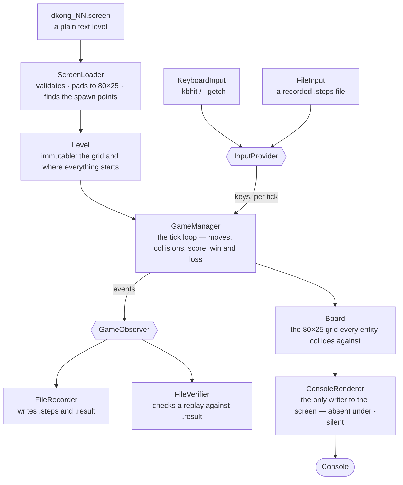
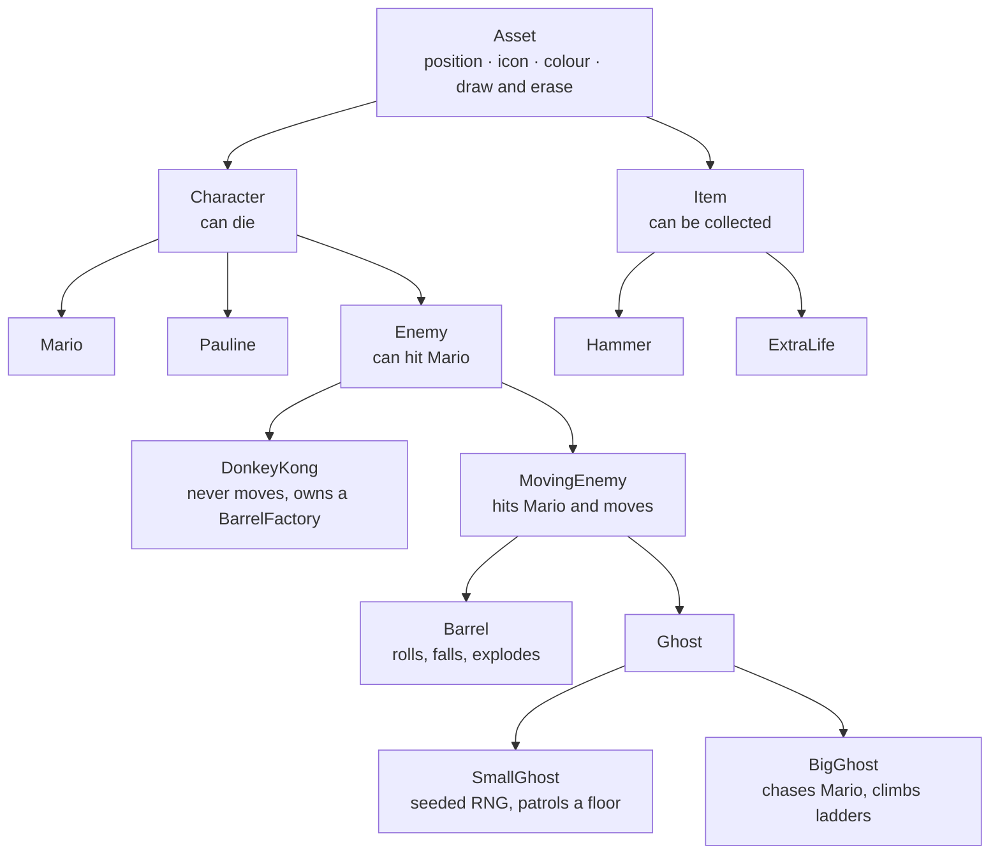

<div align="center">

# Mario

**by Gal Rubinstein**

[](#compile "Compile")
[](#compile "Compile")
[](#platform-support "Platform support")

Windows only — the console is the renderer:

[](https://www.microsoft.com/software-download/windows11 "Download Windows 11")
[](https://visualstudio.microsoft.com/downloads/ "Download Visual Studio")
[](https://aka.ms/terminal "Download Windows Terminal")

</div>

Mario is a Donkey Kong arcade climb drawn in 80×25 characters of console text, written in C++. Barrels roll down sloped floors, ghosts patrol and hunt, a hammer smashes both, and Pauline waits at every screen. Levels are plain text files you can edit in Notepad and drop next to the executable. Any playthrough can be recorded to a pair of files and replayed tick-for-tick afterwards, which is also how the project tests itself.

**No engine, no libraries, no assets.** Everything is the C++ standard library plus the Windows console API.

**Levels are data, not code.** The game reads whatever `dkong_NN.screen` files it finds beside it, validates each one, and plays the valid ones in order.

* [INSTALLATION](#installation)
    * [Levels](#levels)
    * [Compile](#compile)
* [PLATFORM SUPPORT](#platform-support)
* [HOW TO PLAY](#how-to-play)
    * [Controls](#controls)
    * [The menu](#the-menu)
    * [What the glyphs mean](#what-the-glyphs-mean)
    * [Lives and score](#lives-and-score)
* [HOW IT WORKS](#how-it-works)
    * [The class hierarchy](#the-class-hierarchy)
    * [The level file](#the-level-file)
    * [Recording and replay](#recording-and-replay)
* [CONTRIBUTING](#contributing)
    * [Opening an issue](#opening-an-issue)
* [FAQ](#faq)
* [LICENSE](#license)

# INSTALLATION

There is nothing to install. The game is a single console executable built from this solution.

1. Clone the repository:

    ```bash
    git clone https://github.com/JusticeIL/Mario
    ```

2. Open `Mario.sln` in Visual Studio 2022.
3. Build and run — the green play button, or `Ctrl+F5`.
4. Make sure the `dkong_NN.screen` files sit in the working directory the game is started from. See [LEVELS](#levels).

The console window must be at least **80 columns by 25 rows**. Everything is positioned absolutely with `SetConsoleCursorPosition`, so a narrower window wraps the board and the picture falls apart.

## LEVELS

Levels are not compiled in. At startup the game scans its **working directory** for files named exactly `dkong` + two digits + `.screen`, sorts them by name, and plays them in that order. Add `dkong_08.screen` next to the others and it becomes the eighth stage; delete one and the rest close ranks.

The `.screen` files are listed in `.gitignore`, so a fresh clone does not carry any. Copy them into the working directory before starting a game, or the menu answers with "No valid level files found". The format is in [THE LEVEL FILE](#the-level-file).

A screen that fails validation does not stop the game — it is dropped and its reason is recorded. **Options → Console log** lists every rejected file with the reasons, `q` and `e` to page through them.

## COMPILE

Open `Mario.sln` in Visual Studio 2022 and build. The project targets **MSVC v143** with **`/std:c++20`** and conformance mode on, in `Debug` and `Release`, for `x64` and `x86`.

Two things the repository deliberately does not track, both listed in `.gitignore`: the `dkong_*` screen files, and `Mario/Mario.vcxproj` together with its `.filters` and `.user` files. A fresh clone therefore has the solution and all the source, but the project file and the levels have to be supplied locally before the first build.

**Visual Studio is required, not merely convenient.** `Legend.h` calls `min(...)`, which is the `windows.h` macro rather than `std::min`; MSVC compiles it, and a MinGW-w64 `g++ -std=c++20 *.cpp` stops there.

# PLATFORM SUPPORT

Target|Status
:---|:---
Windows 10 / 11 + Visual Studio 2022|Supported
Windows Terminal|Supported — handles the ANSI escape sequences as-is
`conhost.exe` (the classic console window)|Playable. Nothing in the code turns on virtual-terminal processing, so on an old host **Colors** may print escape sequences instead of colouring the board. Turn colour off in Options
Linux / macOS|Not supported — `windows.h`, `conio.h` and `system("cls")` have no equivalent here

# HOW TO PLAY

Get Mario from the bottom of the screen to Pauline at the top without being hit. Ladders go up, floors slope, barrels come down, and the score is falling the whole time you think about it.

## CONTROLS

Key|Action
:---|:---
`w`|Up — climb a ladder, or jump if standing on a floor
`a`|Left
`d`|Right
`x`|Down — climb down a ladder
`s`|Stay
`p`|Swing the hammer, once you are carrying it
`ESC`|Pause, and `ESC` again to resume

Keys are read one at a time and remembered: press `d` and Mario keeps walking right until you press something else. A jump rises two rows and carries whatever horizontal direction Mario already had, so it is one press, not a held key. `w` on a ladder climbs instead of jumping — the two never fight over the same press.

The hammer is picked up by walking onto the `p` on the board; Mario's own icon changes to `M` to show he is carrying it. A swing only starts if Mario is facing left or right and there is no wall immediately in front of him, and he cannot move while it is out.

## THE MENU

Key|Screen
:---|:---
`1`|Start a new game — from the first screen, with three lives
`2`|Specific level — pick any loaded screen and play just that one
`3`|Options
`4`|Instructions
`9`|Exit

Inside **Options**:

Key|Setting
:---|:---
`5`|Colors, on or off. Off is plain white text; on paints ladders cyan, walls and floors pink, barrels orange, Donkey Kong bright red, Pauline pink, the hammer brown, an extra life green and the legend blue
`6`|Console log — why each rejected `.screen` file was rejected, `q` and `e` to page
`7`|Difficulty. **Easy** is a 150 ms tick, **Hard** is 50 ms — the same game three times faster

## WHAT THE GLYPHS MEAN

Glyph|Meaning
:---|:---
`@`|Mario
`M`|Mario, carrying the hammer
`$`|Pauline — touch her and the screen is won
`&`|Donkey Kong. He never moves, but he is solid and he throws
`O`|A barrel
`x`|A small ghost — patrols one floor, turns around at ledges and occasionally on a whim
`X`|A big ghost — walks toward Mario and climbs ladders to reach him
`p`|The hammer, waiting to be collected
`T`|An extra life
`H`|A ladder
`Q`|A wall
`<` `=` `>`|Floor. A barrel rolls the way the character points; `=` keeps its current direction
`L`|Where the legend is drawn. It is a marker, never a visible character

## LIVES AND SCORE

Mario starts each game with **3 lives**. A `T` adds one, with no upper limit.

He loses one to a barrel, a ghost, Donkey Kong, or a fall of **five rows or more** — landing from four is free. Losing the last one is Game Over and returns you to the menu.

The score starts at **10,000** on every screen and drains steadily while you play, so the fastest route is the highest score. How fast it drains is derived from the tick length, which keeps the two difficulties comparable rather than punishing Hard twice.

Event|Score
:---|:---
Each tick of standing around|Roughly −1 point every 5 ticks on Easy, every 40 on Hard
Smashing a barrel or a ghost with the hammer|+10

There is one more way to score, and it is not written down here. The legend is drawn on the board like everything else, and Mario has a head — the rest is yours to find.

# HOW IT WORKS



A replay is not a special mode inside the game — it is a different `InputProvider`. Recording and verifying are the same event stream read by two different observers. And the renderer being optional is what lets the whole game run with nothing drawn at all.

## THE CLASS HIERARCHY



`~Asset` erases the entity from both the board and the console, so destroying an object is what removes it from the screen — there is no separate cleanup pass.

## THE LEVEL FILE

A screen is a plain text file, up to 80 columns and 25 rows. Short lines are padded with spaces, long ones are cut at column 80, and missing rows are filled in — so the shipped screens can carry `// 12` row numbers past the 80th column and the board never sees them.

Every screen must contain exactly one of each:

Character|Meaning
:---|:---
`@`|Mario's spawn. Removed from the grid once read
`$`|Pauline
`&`|Donkey Kong
`L`|The top-left corner of the legend

and at least one of each of a floor tile (`<`, `=`, `>`), a wall (`Q`) and a ladder (`H`). Everything else is optional and may repeat: `x`, `X`, `T`, and a single `p`.

Anything that fails is listed with all of its reasons at once, so one pass through the console log tells you everything wrong with the file rather than one problem at a time.

## RECORDING AND REPLAY

Flag|Effect
:---|:---
`-save`|Record. Each level writes `dkong_NN.steps` and `dkong_NN.result` beside the screen it came from
`-load`|Replay. Reads the same two files back, plays the run without a keyboard, and verifies every event against the recording
`-silent`|Draw nothing. Only meaningful with `-load`, where it turns a replay into a pass/fail test

`-load` wins over `-save`; the two are never on at once.

`.steps` opens with `<seed> <refreshRateMs>` and then lists one `<tick> <key>` line per keypress. `.result` lists one `<tick> <event>` line per thing worth checking — the event character is the icon of whatever killed Mario, `@` for a fall, and `$` for reaching Pauline, with the expected score appended on that last one.

On replay the logical tick length is taken from the file, so the physics match the recording, while the render delay drops to 5 ms so you are not made to watch it in real time. A mismatch throws immediately with the tick number and both values; `-load -silent` prints either **Test Passed** in green or the mismatch in red, in the middle of an otherwise empty screen.

# CONTRIBUTING

## OPENING AN ISSUE

Say which screen you were on, which difficulty, and whether colour was on. The most useful thing you can attach is the `.screen` file together with its `.steps` and `.result` — that trio reproduces the run exactly, on any machine.

If levels are missing rather than misbehaving, check **Options → Console log** first: a screen that failed validation says so there, with the reason.

Two things are expected behaviour rather than bugs: the score falls while you stand still, and a `.screen` file with two Marios in it never loads.

# FAQ

**"No valid level files found."**
The `dkong_NN.screen` files are not in the working directory the game was started from. Under Visual Studio that is the project folder, not `x64\Debug`. They are gitignored, so a clone starts without them.

**The board is covered in `[36m` instead of colours.**
The console host is not interpreting ANSI escape sequences and the game does not force it to. Run it in Windows Terminal, or turn Colors off in Options.

**A barrel blew up on its own.**
That is the rule: a barrel that falls eight rows or more explodes when it lands, in two radii, and takes itself off the board.

**Mario died and nothing touched him.**
A fall of five rows or more is fatal. Four is survivable, and the counter resets the moment he lands or catches a ladder.

**Hard mode looks like it scores better.**
It drains fewer points per tick, but its ticks are three times faster, so the two work out close in real time. Hard is about reaction speed, not about the arithmetic.

**How do I add a level?**
Copy an existing `.screen`, edit it in any text editor, and name it `dkong_08.screen`. Keep exactly one `@`, `$`, `&` and `L`, and at least one floor, wall and ladder. See [THE LEVEL FILE](#the-level-file).

**Can I replay a recording made on another machine?**
Yes — the seed and the tick length travel inside the `.steps` file, so the run reproduces anywhere. The `.screen` file has to be the same one, though.

**Does it run on Linux or macOS?**
No. See [PLATFORM SUPPORT](#platform-support).

# LICENSE

This game and all of its source code and visuals are © 2025-2026 Gal Rubinstein. All rights reserved. Commercial use is not permitted without written consent, and this repository is intended for educational or personal use only. If you use this project or parts of it, credit is required. The full text is in [LICENSE.txt](LICENSE.txt).
